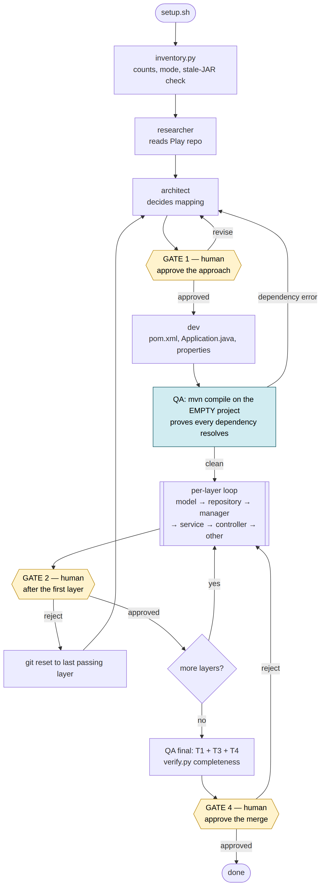

# Play-to-Spring Boot migration

A Claude Code plugin that migrates a **Play Framework (Java)** repo to
**Spring Boot** using four agent roles coordinated through shared state, with
a single upfront human review gate.

Deterministic work is done by tools; judgment is done by agents; sequencing
lives in skill documents rather than in orchestration code.

## Motivation

Why move off Play at all: Spring Boot has a much bigger community and more
support. Play's growth has stalled. Play was built for Scala first — its
Java support is just a wrapper around that, so anything custom is harder to
do than it should be. And AI coding tools like Cursor barely understand Play
code — we tried wrapping it with Metals, but it never felt natural, and that
alone has become a real blocker for team adoption.

Migrations are always painful, and Play Framework (Java) to Spring Boot is a
migration between fundamentally different philosophies, not just two Java
web frameworks — folder structure, how a controller is even called, routes vs.
declarative annotation mapping.

We first did this by hand on a small service. Most of it was mechanical:
copying a Java skeleton across, fixing imports because the dependencies and
their references differ between frameworks, reshaping the layout to match
Spring's conventions. That part is exactly the kind of work you can run
deterministically, with a tool, every time, the same way. A smaller slice
isn't — it needs a judgment call from whatever's touching the code. Play's
`ExecutionContext`, for example, has no one true Spring equivalent; a model
can look at how it's used and pick the right thread-pool replacement, but you
can't hand-write that mapping source-to-target ahead of time for every case.

So: deterministic steps run as tools (layout creation, skeleton copy, the
AST-driven transform), and the decisions that can't be pinned down ahead of
time are left to an LLM. That split is the plugin — four subagents (researcher,
architect, dev, qa) do the execution and judgment, each updating its own
state; a manager (orchestrator) reads that state and drives what happens next.

This is also the answer to "just prompt it: migrate this repo to Spring
Boot." A lot of engineers assume that works. It doesn't survive contact with
a real repo — one context window can't hold research, an architecture
decision, hundreds of files of mechanical porting, and verification at once
without losing track of what it already decided three files ago, and a
single pass gives you no gate to catch a wrong dependency choice before it's
baked into every layer. Splitting research, architecture, dev, and QA into
separate passes with a written record between them is what makes a
multi-hour, hundreds-of-file migration hold together instead of drifting.

The manager also watches for loops — a dev agent retrying an unfixable import
forever (an Akka actor system has no Spring equivalent, say) gets a hard
retry limit, and the failure is written to the journal instead of spinning,
so the manager can read it and move on.

Roughly how a run goes: inventory the source repo, research it, have an
architect turn that research into a plan you approve once, then dev migrates
layer by layer (fail fast if a layer can't be fixed, rather than break
everything built on top of it later), then QA verifies before/after. Only the
manager can write the shared state file, so agents can't step on each other.
Full breakdown of each step below, in "How it works."

At the end, the plugin reports what migrated, how long it took, and roughly
what it cost in tokens — plus any gaps it hit along the way, safe to share
since business object names are obfuscated. See "Reporting gaps" below.



## How it works

| Role | Writes code | Job |
|---|---|---|
| **orchestrator** (main thread, triggered by `/migrate`) | no | Owns state, sequences layers, dispatches subagents, enforces the gate, commits |
| **researcher** | no | Surveys the Play repo before anything is built |
| **architect** | no | Decides the dependency, config, and idiom mapping — before dev starts |
| **dev** | **yes** | Runs the transformer, compiles, fixes compile errors. The only role that writes source |
| **qa** | no | Verifies endpoint responses before and after; rules on results a script cannot judge. Never fixes |

```
orchestrator → researcher → architect ──── GATE 1 (you approve the approach)
                                        ↓
   dev writes pom/Application → gate.py compiles the EMPTY project (dependency check)
                                        ↓
   per layer:  dev → gate.py ──findings──┐   model → repository → manager
                 ↑────────────────────────┘   → service → controller → other
               passes → commit → next layer, unattended
     (a layer that exhausts retries joins failed_layers; the run keeps going)
                                        ↓
        gate.py --final + QA endpoint diff → report.py → report.html + chat summary
```

Sequential by design: the layer dependency order is real, and verifying
half-migrated code is noise. Gate 1 is the only stop — once you approve the
architecture, the rest of the run is unattended through to the report.

Diagrams of the full flow, the dev/gate correction loop, endpoint parity, and who
writes what: **[docs/FLOW.md](docs/FLOW.md)**.

### Why the roles are split this way

- The **researcher** runs first because the standard failure of coding agents is
  confident output that ignores how the codebase actually works.
- The **architect** gate exists because a wrong `pom.xml` is not one bug — it is
  the same bug in every layer, found one layer at a time.
- **Dev owns the compile.** Nobody should be dispatched to discover a missing
  import. The migrate skill re-runs the build in the gate regardless: dev's
  report is a claim, the re-run is evidence.
- **The verification gate is a script, not an agent.** T1–T4 are deterministic,
  so the migrate skill runs them itself via `scripts/tools/gate.py`. Wrapping
  them in a dispatch cost a round trip per layer and returned the same finding
  the script had already produced.
- **QA never fixes**, because an agent that fixes what it checks stops finding
  things. It is dispatched for the judgment a script cannot supply: endpoint
  response parity, and attributing a failure to the layer that actually caused it.

### Why dev-toolkit does the transform, not the agent

A separate Java-AST tool (dev-toolkit) does the mechanical file-by-file port;
the dev agent runs it rather than freehand-porting every file. Reasons,
distinct from "agents are fallible":

- **Reproducible.** Same file in, same file out, every run — testable in a
  way free-form LLM output isn't.
- **Independent of the check that grades it.** If the same model both wrote
  the translation and were the only thing checking it, that check would be
  the model grading its own homework.
- **Cheap at scale.** Hundreds of files of pure boilerplate substitution
  carry zero judgment — spending agent tokens on them buys nothing.
- **Consistent across a long run.** A model asked to migrate a file a hundred
  times over a multi-hour session can drift in style file to file; a rule
  applied by code does not.

The agent is reserved for what a rule genuinely can't decide: fixing compile
errors the transform's output produces, porting logic the tool can't handle,
and QA's judgment calls. Everything mechanical stays in the tool; everything
that requires reading code and deciding stays with the model.

## Install

Self-hosted marketplace (until this plugin lands in the public
`claude-community` marketplace review):

```
/plugin marketplace add skarin7/play-to-springboot
/plugin install play-to-springboot@play-to-springboot-marketplace
```

Or point Claude Code straight at a local clone for development:

```bash
claude --plugin-dir /path/to/play-to-springboot
```

**Requirements:** Java 17+, Maven, Python 3.10+, network access on first run
(to fetch the dev-toolkit jar — cached after that).

## Quick start

```
/play-to-springboot:migrate /path/to/your-play-app
```

That's the whole thing. The first run scaffolds the workspace (Spring repo
skeleton, `workspace.yaml`, `.migration/`) and fetches the checksum-verified
dev-toolkit jar automatically — no separate setup step. It stops once, at
Gate 1, with the architect's decisions for your review; after you approve,
the rest of the run — every layer, the final verification, the report — goes
unattended.

### Run flags

```
/play-to-springboot:migrate /path/to/your-play-app --skip-t5 --mode collapsed
```

| Flag | Effect |
|---|---|
| `--skip-t5` | No endpoint-parity dispatch, and no application is booted |
| `--skip-tests` | Final gate runs T1–T3; T4 is reported `skipped`, never passed |
| `--no-boot` | Nothing is launched at all (implies `--skip-t5`) |
| `--mode collapsed\|full` | Override the inventory's role-mode choice |
| `--max-dispatches N` | Stop and report after N subagent dispatches |
| `--assets-policy skip\|require` | `require` demands real Spring mappings for Play's built-in asset routes |

Flags are read once at launch. To change scope mid-run, see
[docs/ORCHESTRATION.md](docs/ORCHESTRATION.md) for the run-control file.

### Permissions

A run is a few hundred invocations of about six commands. The plugin ships a
`PreToolUse` hook that auto-allows its own path-scoped commands and **denies any
write into the Play repo**. For an explicit allow list with your workspace's
resolved paths:

```bash
bash scripts/setup.sh /path/to/your-play-app --print-permissions
```

Details and what is deliberately not granted: **[docs/PERMISSIONS.md](docs/PERMISSIONS.md)**.

### Reporting gaps

Your Play repo will contain something this kit has no rule for. When that
happens an agent improvises, and that improvisation is invisible — the run can
go green with a hand-ported template or a method that exists only to satisfy a
check. Agents record those moments to `.migration/gaps.jsonl`, and:

```bash
python3 "$CLAUDE_PLUGIN_ROOT/scripts/tools/gap_report.py" render --spring-repo <spring>
```

writes a **redacted** `.migration/gap-report.md`: framework symbols and Maven
coordinates verbatim, your class names and paths replaced with per-install
salted hashes, no source and no finding text. **Nothing is uploaded** — there is
no network code in that tool. Read it; share it on an issue if you want the gap
fixed upstream.

Full field list, the promotion rule, and what is deliberately not done:
**[docs/GAPS.md](docs/GAPS.md)**.

Check back on a run any time without re-running it:

```
/play-to-springboot:report /path/to/your-play-app
```

opens/regenerates `.migration/report.html` — a self-contained, offline page
with per-layer status, the full QA findings table, T5 endpoint-parity results,
and commit references.

## Verification tiers

| Tier | What | When | Who runs it |
|---|---|---|---|
| **T1** compile | `mvn compile` exits 0 | every layer | dev, then `gate.py` |
| **T2** structural preservation | signature diff Play vs Spring | every layer, scoped to that layer | `gate.py` |
| **T3** route parity | `conf/routes` vs Spring mappings | after `controller`, and final | `gate.py` |
| **T4** tests | `mvn test` | final | `gate.py --final` |
| **T5** endpoint responses | responses captured from both apps, diffed | final | **QA agent** |

Two of these earn their place by catching what the others cannot: **T2**
catches a file that compiles and keeps every method but had a body replaced
with `return null`; **T5** catches everything structural checks are blind
to, since it's the only tier that proves Play and Spring return the same
thing rather than just that both build and answer at the right paths.

Full rationale, including why each tier is scoped the way it is:
[docs/ORCHESTRATION.md](docs/ORCHESTRATION.md#phase-4--endpoint-parity-t5).

The scripts behind these tiers (`gate.py`, `endpoint_diff.py`,
`signature_diff.py`, etc.) live in `scripts/tools/` and are documented there;
run `python3 tests/test_tools.py` to exercise them (96 tests, stdlib
only).

## Layout

```
play-to-springboot/                     (plugin root)
├── .claude-plugin/{plugin.json,marketplace.json}
├── LICENSE
├── skills/{migrate,report}/SKILL.md    # /play-to-springboot:migrate, :report
├── agents/{researcher,architect,dev,qa}.md
├── hooks/{hooks.json,allow_migration_tools.py}   # path-scoped auto-allow + Play-write deny
├── scripts/{setup.sh,migration_orchestrator.py,tools/}
│   └── tools/toolkit-release.json      # pins {version, download_url, sha256}
├── config/workspace.example.yaml
└── docs/{STATE-CONTRACT.md,ORCHESTRATION.md,PERMISSIONS.md,FLOW.md,...}

workspace/                              (created per target Play repo)
├── <play-repo>/                        # READ-ONLY during migration
├── spring-<basename>/
│   ├── migration-status.json           # single source of truth
│   ├── .migration/                     # research.md, decisions.md, journals, report.html
│   └── src/main/java/
├── workspace.yaml
└── route-map.json                      # populated from conf/routes
```

The dev-toolkit jar lives in `$CLAUDE_PLUGIN_DATA` (fetched once per version,
cached across runs and across target repos) — it is never copied into either
repo.

## State and resumability

Only the migrate skill writes `migration-status.json`; subagents report
through artifacts and append-only journals under `.migration/`, which is what
lets a killed subagent resume rather than restart. Re-running
`/play-to-springboot:migrate` is always safe — completed work is skipped, and
a layer recorded as failed is retried from scratch rather than silently
re-skipped.

Full schema, handoff rules, and gate semantics: **[docs/STATE-CONTRACT.md](docs/STATE-CONTRACT.md)**.

## Gotchas

Things this design does not, and mostly cannot, guarantee:

- **Orchestration is prose, not code.** The loop lives in the skill as
  instructions an agent follows, not an enforced state machine. A model that
  skips a step isn't stopped by anything except your review at Gate 1, or the
  final gate catching the shortfall late.
- **The single-writer rule for the status file is a convention, not a lock.**
  Nothing at the filesystem level stops a subagent from writing it directly.
- **The compile, structural, route, and test checks (T1–T4) are
  deterministic; the transform's edge cases and QA's endpoint judgment
  (T5) are not.** The same endpoint diff can get a different judgment call
  session to session even though the scripts around it can't.
- **The structural-preservation check (T2) is narrow by design, which means
  real blind spots.** It catches a missing method or a large statement
  collapse, not "compiles, keeps every statement, does something subtly
  different." An inverted condition or an off-by-one passes every automated
  check clean; only the endpoint-response check (T5) has a chance, and its
  coverage of data-mutating requests (POST/PUT/DELETE) is off by default —
  only GET requests are checked out of the box.
- **Views, static assets, and i18n bundles are not migrated at all.** Left in
  the Play repo and out of scope for every check here — a migrated app that
  served HTML pages will not serve them.
- **Structural-check (T2) exemptions can suppress a blocker.** Framework
  glue whose Spring counterpart is a genuinely different interface is
  suppressed rather than reported, because reporting it made the cheapest
  fix a fake method that satisfied a regex. Suppressions are listed in the
  report, so you can check the mechanism wasn't over-used.
- **A layer that keeps failing doesn't stop the run — you find out at the
  end.** It hits its retry limit, gets recorded as failed, and the run keeps
  going; you read about it in the chat summary or the report, not in the
  moment it happened.

Full detail on each of these: [docs/STATE-CONTRACT.md](docs/STATE-CONTRACT.md),
[docs/ORCHESTRATION.md](docs/ORCHESTRATION.md).

## Notes

- The dev-toolkit jar's provenance is a checksum, not a filename or an
  inspected marker class. `scripts/tools/toolkit-release.json` pins
  `{version, download_url, sha256}`; `fetch_jar.py` refuses to hand back
  anything that doesn't match. See the sibling
  [`java-dev-toolkit`](https://github.com/skarin7/play-to-spring-boot-migration-agent)
  repo for how that release is built and published.
