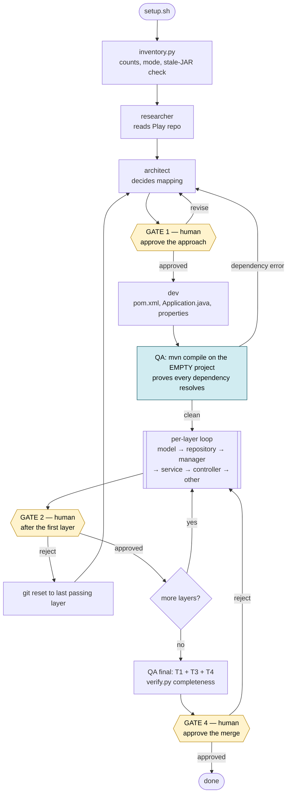
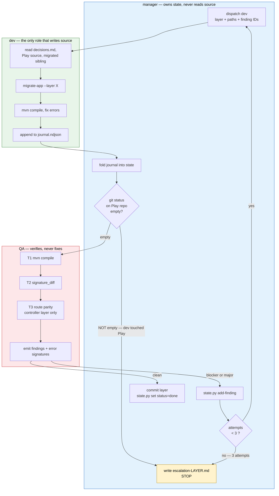
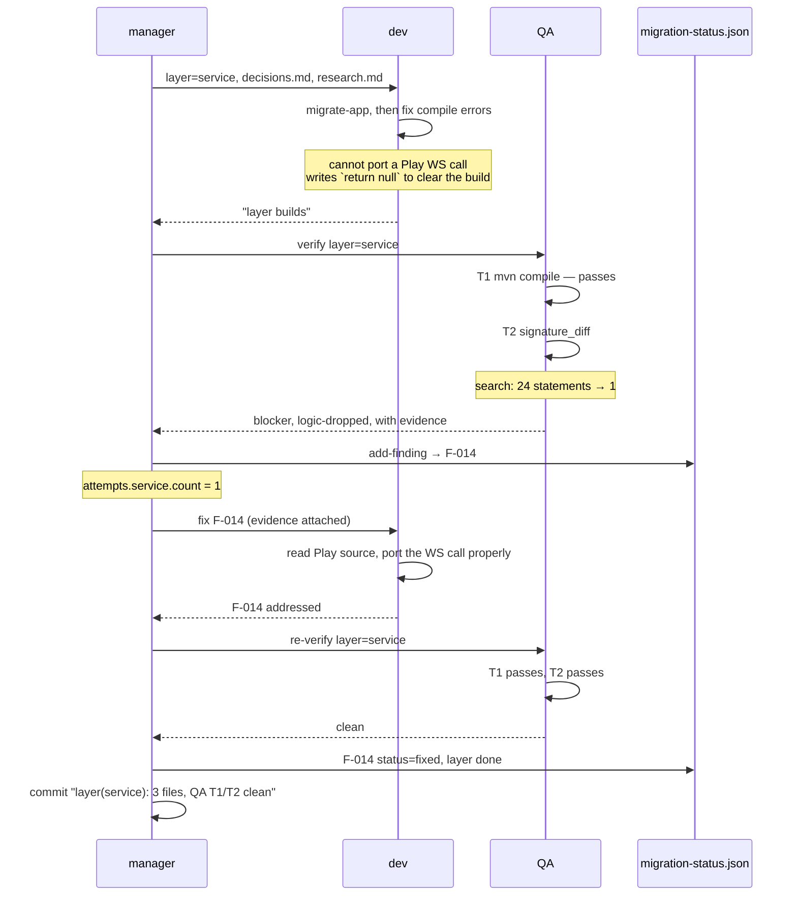
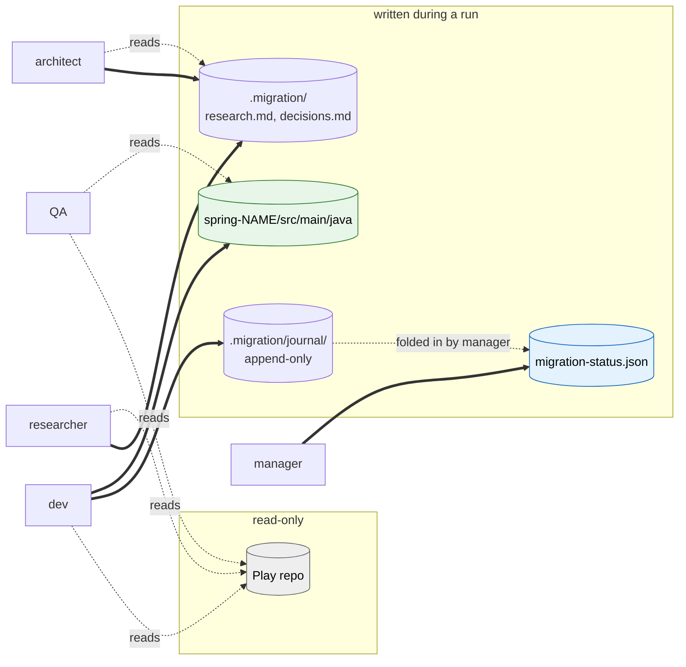
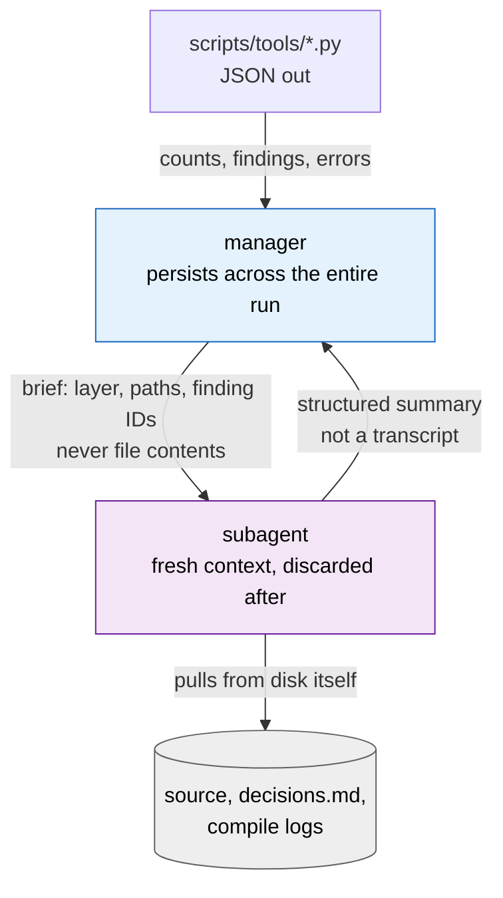

# Migration flow

Diagrams of how a run is sequenced, how the dev/QA loop corrects itself, and who
is allowed to write what.

For the operator walkthrough see [ORCHESTRATION.md](ORCHESTRATION.md); for the
schema and gate rules see [STATE-CONTRACT.md](STATE-CONTRACT.md).

---

## 1. End to end



The empty-project compile is worth its own box. Zero sources, but it fails a bad
dependency map in a minute instead of surfacing as strange compile errors four
layers deep.

---

## 2. The dev ↔ QA loop

This is the self-correcting part. Dev writes; QA verifies and hands back findings
with evidence; the manager re-dispatches with those findings attached.



### Why the loop closes instead of spinning

**QA never trusts dev's claim.** "The layer compiles" is not evidence; QA re-runs
`mvn compile` itself. Dev cannot mark its own work complete.

**Findings carry evidence, not just errors.** A raw error dump produces a guess.
A finding like `ContentService.search: 24 statements in Play -> 1 in Spring`
points at the cause.

**Attempts are bounded.** Three tries, then a human sees one file rather than a
transcript. Repeating a failing approach does not make it work.

---

## 3. A finding's life



T1 passed on the stub. Counting files would also have passed — a stubbed method
is still one migrated file. T2 is the only tier that sees it.

---

## 4. Who writes what

The single-writer rule, and why subagents report instead of writing state.



- **Only dev writes source**, and only into the Spring tree. Enforced by tool
  grants in `.claude/agents/`; backstopped by the `git status` guard on the Play
  repo after every dispatch.
- **Only the manager writes state.** Two writers corrupt the file, and a subagent
  killed mid-write leaves JSON that cannot be resumed from.
- **Dev's journal is append-only.** A subagent's context dies with it; the
  journal is the only thing that survives, so a dev killed at file 8 of 15 is
  resumed rather than restarted.

---

## 5. Context handoff

Why the manager stays cheap while the work stays expensive.



**The invariant: the manager ingests no source code and no raw build output.**

Everything expensive — full compile logs, Java files, failed fix attempts — lives
and dies inside a subagent context that is thrown away. The manager sees JSON and
summaries.

This is load-bearing rather than tidy. Cost is dominated by cache reads, which
scale with context size multiplied by turns; a manager that pulls compile logs
into its own context both runs out of room partway through a large repo and costs
an order of magnitude more. Verify it held:

```bash
python3 scripts/tools/token_report.py --project /path/to/play-repo --by-agent
```

A manager share of input tokens that climbs layer over layer means the handoff
rules leaked.
