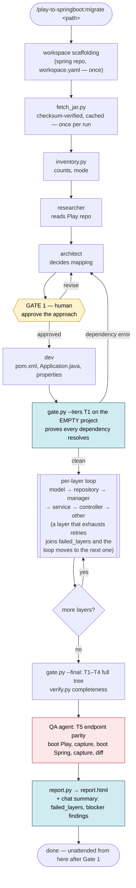
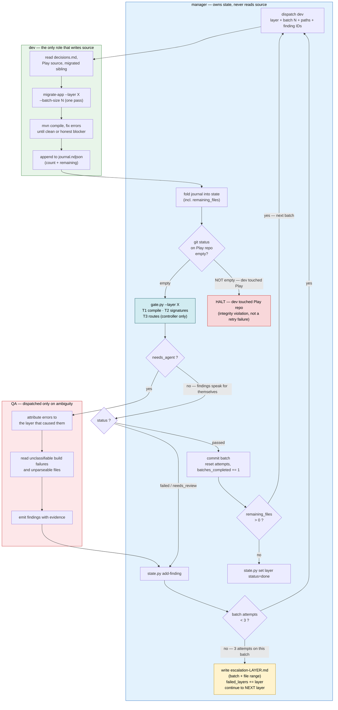
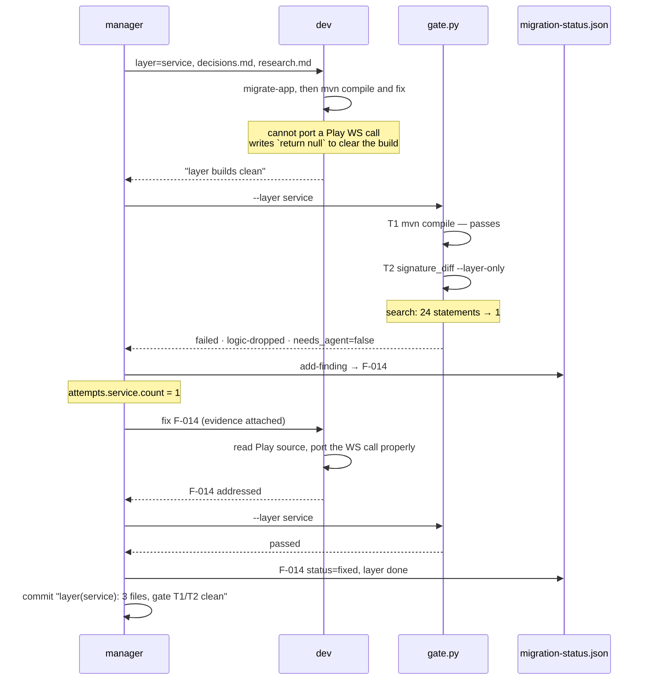
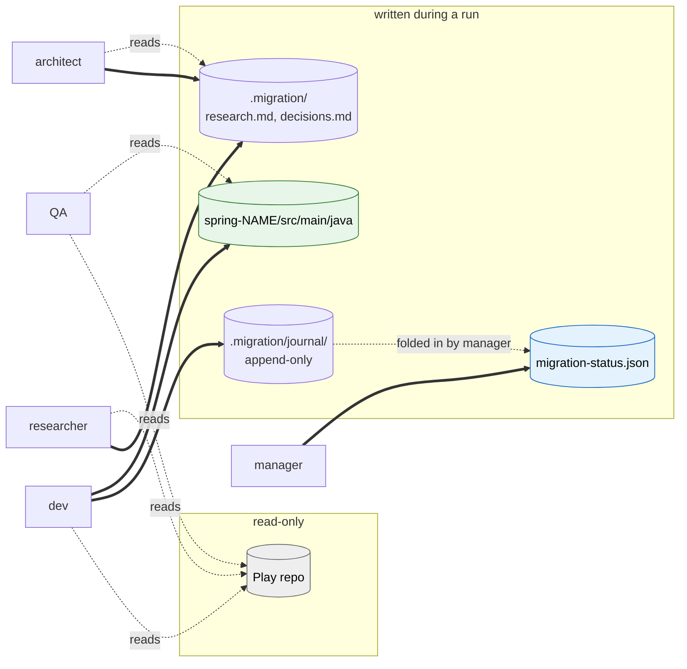
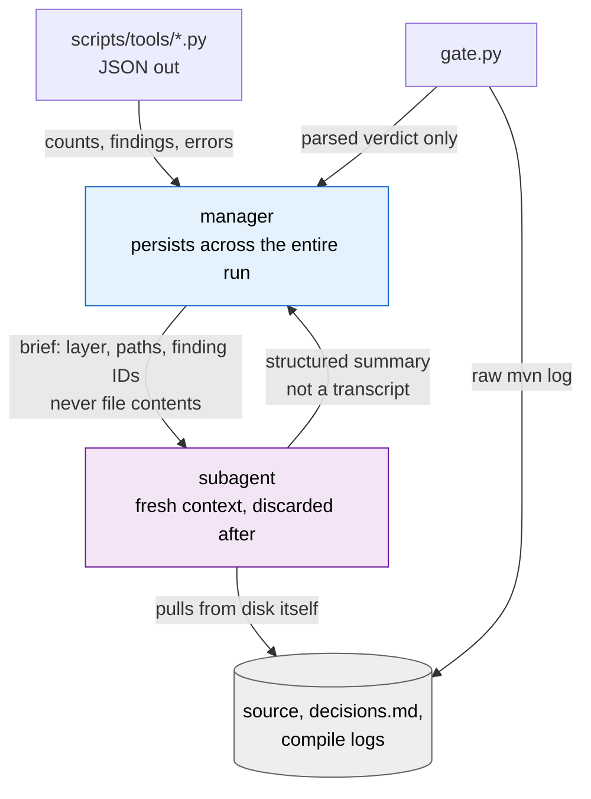
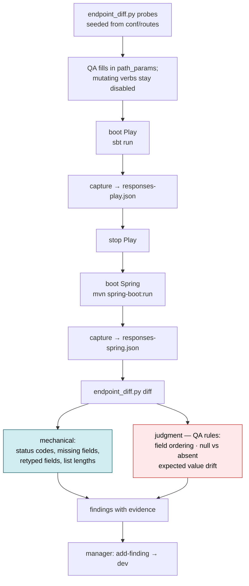

# Migration flow

Diagrams of how a run is sequenced, how the dev/gate loop corrects itself, who is
allowed to write what, and how endpoint parity is proved.

Rendered PNGs sit alongside this file for viewers without mermaid support.

For the operator walkthrough see [ORCHESTRATION.md](ORCHESTRATION.md); for the
schema and gate rules see [STATE-CONTRACT.md](STATE-CONTRACT.md).

---

## 1. End to end



[PNG](flow-1-end-to-end.png)

Gate 1 is the only stop in the run. Two earlier gates — after the first layer,
and again before merge — were dropped: once the architecture is approved, the
whole pipeline runs unattended through to the report, and a human reviews the
outcome afterward via the chat summary and `report.html` rather than being
asked to approve mid-run.

The empty-project compile is worth its own box. Zero sources, but it fails a bad
dependency map in a minute instead of surfacing as strange compile errors four
layers deep.

T5 is the other box worth pausing on. T1–T4 prove the code compiles, kept its
methods, and answers at the right paths. Only T5 proves it returns the same
thing — and it is the one tier that needs both applications running, which is why
it is a QA dispatch rather than a subprocess.

---

## 2. The dev ↔ gate loop

This is the self-correcting part. Dev writes **and compiles**; the manager runs
the scripted gate; findings with evidence go back to dev. QA is dispatched only
when the gate cannot rule on its own result.

The loop runs once per **batch**, not once per layer — a skewed layer (say
100 files in `service` against 5 in `model`) gets gated and committed in
`batch_size`-sized slices instead of as one giant pass, so a layer's size
never changes how quickly a problem surfaces or how much work a rejected gate
throws away.



[PNG](flow-2-dev-gate-loop.png)

### Why the loop closes instead of spinning

**Dev owns the compile; the manager still re-runs it.** Dev fixing its own build
errors is what keeps the loop short — nobody should be dispatched to discover a
missing import. But dev's "the layer compiles" is a claim, and `gate.py` re-runs
`mvn compile` regardless. Dev cannot mark its own work complete.

**The gate is a subprocess, not a dispatch.** All four scripted tiers are
deterministic, so wrapping them in an agent cost a full round trip per layer and
returned the same finding the script had already produced. QA is now dispatched
only for the cases in the `needs_agent` branch — chiefly attributing an error to
a layer that was already signed off, which is the one thing dev left alone gets
persistently wrong.

**Findings carry evidence, not just errors.** A raw error dump produces a guess.
A finding like `ContentService.search: 24 statements in Play -> 1 in Spring`
points at the cause.

**Attempts are bounded, per batch.** Three tries on the *current batch*, then
the layer joins `failed_layers` and the run moves on to the next layer instead
of stopping — a human reads one escalation file covering that batch, via the
chat summary or `report.html`, rather than a transcript of the whole layer and
rather than being interrupted mid-run. The counter resets when a batch passes,
so a layer with several easy batches and one hard one escalates only on the
hard one. Repeating a failing approach does not make it work.

---

## 3. A finding's life



[PNG](flow-3-finding-lifecycle.png)

Three things this trace shows:

- **T1 passed on the stub.** Counting files would also have passed — a stubbed
  method is still one migrated file. T2 is the only tier that sees it.
- **Dev claimed a clean build and was right.** The claim still bought nothing;
  the gate re-ran the compile anyway.
- **No QA dispatch.** `needs_agent` is false because a `logic-dropped` finding
  already names the class, the method, and both statement counts. Dispatching an
  agent here would return the same sentence one round trip later.

---

## 4. Who writes what

The single-writer rule, and why subagents report instead of writing state.



[PNG](flow-4-write-ownership.png)

- **Only dev writes source**, and only into the Spring tree. Enforced by tool
  grants in this plugin's `agents/` directory; prevented up front by the
  plugin's `PreToolUse` hook, which denies Play-repo writes; and backstopped by
  `guard.py`, which the gate runs before every tier and which reports
  `clean` / `tampered` / `error` rather than inferring cleanliness from silence.
- **Only the manager writes state.** Two writers corrupt the file, and a subagent
  killed mid-write leaves JSON that cannot be resumed from.
- **Dev's journal is append-only.** A subagent's context dies with it; the
  journal is the only thing that survives, so a dev killed at file 8 of 15 is
  resumed rather than restarted.

---

## 5. Context handoff

Why the manager stays cheap while the work stays expensive.



[PNG](flow-5-context-handoff.png)

**The invariant: the manager ingests no source code and no raw build output.**

Everything expensive — full compile logs, Java files, failed fix attempts — lives
and dies inside a subagent context that is thrown away. The manager sees JSON and
summaries.

This is load-bearing rather than tidy. Cost is dominated by cache reads, which
scale with context size multiplied by turns; a manager that pulls compile logs
into its own context both runs out of room partway through a large repo and costs
an order of magnitude more. Verify it held:

```bash
python3 scripts/tools/token_report.py --project /path/to/play-repo --by-agent
```

A manager share of input tokens that climbs layer over layer means the handoff
rules leaked.

`gate.py` is what lets the manager own verification without owning build output:
the raw Maven log goes to `.migration/logs/`, and only the parsed verdict crosses
into the manager's context.

---

## 6. T5 — endpoint response parity

The tier that proves behaviour rather than structure, and the reason QA still
exists as a role.



[PNG](flow-6-endpoint-parity.png)

**Why values are masked before comparing.** Timestamps, generated ids and
durations differ between two runs of the *same* application. Comparing them for
equality fails every correctly migrated endpoint, and a tier that always
complains is a tier nobody reads by the third layer. They are checked for
presence and type instead — a masked `id` that changes from number to string is
still a finding.

**Why POST is not probed automatically.** `conf/routes` records a verb and a
path, never the shape of the body an endpoint accepts, and a POST changes the
store it writes to — so the second capture is answering a different question than
the first. Enable mutating probes only with a supplied body and either a
disposable datastore per app or a reset between captures. Otherwise a GET-only
comparison is the honest check, and the mutating paths are reported as unproved
rather than as passing.
